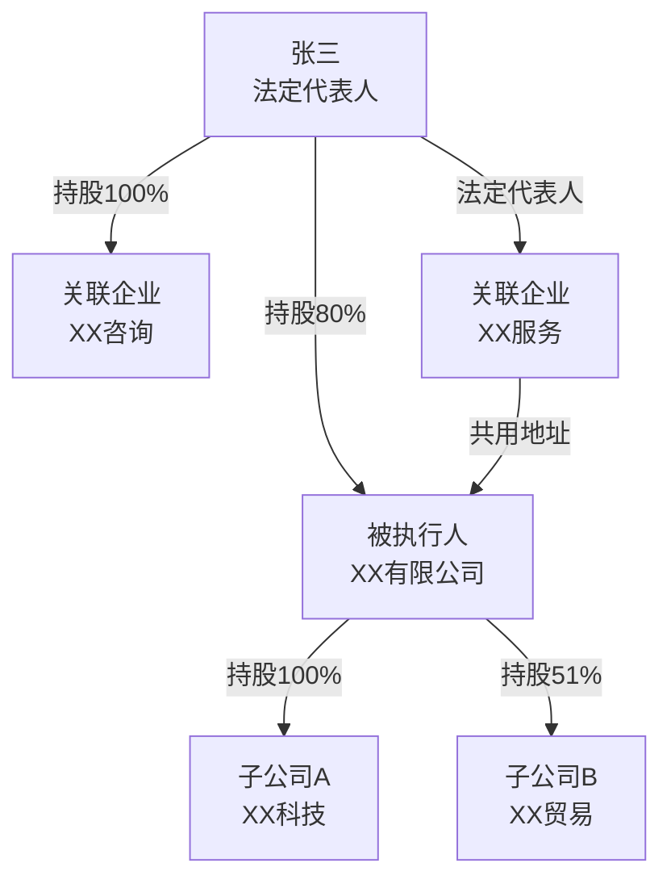

# 执行调查 Skill（企查查 MCP 被执行人财产调查）

## 功能概述

执行案件的瓶颈永远是"找不到财产"。拿到判决书只是第一步，真正的较量在于——对方名下有什么、藏在哪里、什么时候转移的。

本 skill 调用企查查 MCP，对被执行企业（或被执行人关联企业）进行全维度扫描：从工商底档到司法风险，从动产抵押到知识产权，从股权穿透到关联图谱，把所有能查到的资产线索汇成一份结构化调查报告。

**输出不是原始数据堆砌——而是按执行律师的办案思路组织过的、可以直接附卷或提交法院作为财产线索材料的调查报告。**

## 使用场景

- 首执案件立案后，全面排查被执行企业财产
- 终本案件恢复执行前，寻找新财产线索
- 追加被执行人前的关联企业调查（一人公司/股东未实缴/关联混同）
- 被执行人声称"没有钱"时，用调查报告戳穿谎言
- 向法院提交财产线索时的正式附件

## 输入

**方式一：手动指定**
```
调查 北京华宇元典信息服务有限公司
统一社会信用代码：91110108MA0074PN30
```

**方式二：从案件分析底稿读取**（推荐）
```
基于案件分析底稿，调查被执行人企业
```
自动从 `.case-analysis.json` 的 `parties.respondent` 字段提取主体信息。

## 前置条件

1. 企查查 MCP 已在 MyAgents/Claude Code 中配置并可用
2. 如通过企查查 API Key 方式接入，需配置环境变量 `QCC_API_KEY`

---

## 工作流程

### 第一步：确认调查对象

**1.1 确定企业名称和 USCC**

- 如从 `.case-analysis.json` 读取，提取 `parties.respondent.name` + `parties.respondent.id`
- 如手动输入，优先使用统一社会信用代码精确查询
- 如仅知企业名称，先检索匹配确认真实全称和 USCC

**1.2 确定调查范围**

根据被执行人类型决定调查深度：

| 被执行人类型 | 调查范围 |
|-------------|---------|
| 企业（存续） | 本企业 + 对外投资企业 + 分支机构的全部资产和风险 |
| 企业（注销/吊销） | 本企业历史信息 + 股东/清算责任人 + 清算时的财产处置 |
| 企业（一人公司） | 本企业 + 唯一股东个人对外投资和关联企业 |
| 自然人 | 其担任法代/股东/高管的所有企业 + 个人涉诉和失信 |

--- 输出阶段提示 ---
完成第一步后，向用户展示调查对象确认信息，等待确认后继续：

```
🔍 调查对象确认：
- 企业名称：XX有限公司
- 统一社会信用代码：9144010XXXXXXXX
- 法定代表人：XXX
- 调查范围：本企业 + 对外投资 + 分支机构

确认开始调查？（是/否/调整范围）
```

---

### 第二步：工商基本信息

调用企查查 MCP 基础信息接口，获取：

**2.1 企业基本档案**

| 调查项 | 关键字段 | 执行意义 |
|--------|---------|---------|
| 统一社会信用代码 | `uscc` | 所有后续查询的基础 ID |
| 企业名称 | `name` | 精确匹配，注意曾用名 |
| 法定代表人 | `legal_representative` | 谁可以被限消/边控/拘留 |
| 注册资本 | `registered_capital` | 执行上限的理论依据 |
| 实缴资本 | `paid_in_capital` | 股东未实缴 → 追加被执行人 |
| 成立日期 | `establish_date` | 存续时间越长，资产积累可能越多 |
| 注册地址 | `address` | 现场调查的目的地；管辖连接点 |
| 经营状态 | `status` | 存续/吊销/注销/迁出 → 不同执行策略 |
| 经营范围 | `business_scope` | 判断行业类型，推断资产形态 |
| 登记机关 | `registration_authority` | 调取工商内档的单位 |

**2.2 股东及出资信息**

| 调查项 | 关键字段 | 执行意义 |
|--------|---------|---------|
| 股东名称/姓名 | `shareholder_name` | 追加被执行人的目标 |
| 持股比例 | `shareholding_ratio` | 冻结/拍卖股权的范围 |
| 认缴出资额 | `subscribed_amount` | 未实缴部分可追加 |
| 实缴出资额 | `paid_amount` | 差额 = 可追索的未出资额 |
| 出资方式 | `contribution_type` | 货币/实物/知识产权 |
| 出资日期 | `contribution_date` | 是否已届满（加速到期判断） |

**2.3 核心成员**

| 角色 | 姓名 | 执行意义 |
|------|------|---------|
| 法定代表人 | XXX | 限消对象 |
| 执行董事/董事长 | XXX | 实际控制人判断 |
| 总经理 | XXX | 经营负责人 |
| 监事 | XXX | 内部知情人 |
| 财务负责人 | XXX | 资金流向关键人 |

**2.4 变更记录**

重点关注以下变更：

| 变更类型 | 关注点 | 执行意义 |
|---------|--------|---------|
| 法定代表人变更 | 执行立案前后是否突击变更 | 原法代仍可能被认定为实际控制人 |
| 股东变更 | 判决后是否转让股权 | 无偿/低价转让 → 债权人撤销权 |
| 注册资本变更 | 是否减资 | 减资程序是否合法，未通知债权人 → 减资无效 |
| 地址变更 | 是否频繁迁址 | 规避执行 |
| 名称变更 | 是否有曾用名 | 避免遗漏以曾用名登记的财产 |

--- 输出阶段提示 ---
完成后输出工商信息摘要（2-3 段简述 + 风险信号），进入下一步。

---

### 第三步：司法风险扫描

调用企查查 MCP 司法风险接口（或 qcc-risk 模块），获取：

**3.1 被执行人信息**

| 字段 | 执行意义 |
|------|---------|
| 案号 | 其他法院的执行案件（可能已查控到财产） |
| 执行法院 | 联系其他承办法官，了解执行情况 |
| 立案日期 | 判断执行进度 |
| 执行标的 | 累计被执行金额 |
| 案由 | 了解主要债务类型 |

> **🔑 关键动作**：如发现其他法院的执行案件，标注为"跨院执行线索"——其他法院可能已查控到财产，可申请参与分配。

**3.2 失信被执行人（失信）信息**

| 字段 | 执行意义 |
|------|---------|
| 失信行为类型 | 有履行能力拒不履行 / 违反财产报告制度 / 伪造证据妨碍执行 |
| 发布时间 | 失信时长（越久说明履行意愿越低） |
| 履行情况 | 是否已履行（如已全部履行说明有资金来源） |

**3.3 限制消费令**

| 字段 | 执行意义 |
|------|---------|
| 限制消费令数量 | 多份限消令说明债务规模大 |
| 发布时间 | 限消时长 |
| 是否因同一案件 | 区分不同申请人的限消令 |

**3.4 股权冻结**

| 字段 | 执行意义 |
|------|---------|
| 被冻结股权标的企业 | 哪家公司的股权被冻了 |
| 冻结数额 | 冻结的出资额 |
| 执行法院 | 哪个法院冻的 — 联系分享冻结信息 |
| 冻结期限 | 到期日期 → 续冻预警 |
| 冻结类型 | 首冻/轮候冻结 — 是否轮到你 |

> **🔑 关键动作**：如发现其他法院已冻结本被执行人的股权，联系该法院了解冻结财产估值，判断是否值得参与分配或商请移送处置权。

**3.5 股权质押**

| 字段 | 执行意义 |
|------|---------|
| 出质股权标的企业 | 股权所在公司 |
| 出质股权数额 | 质押的出资额 |
| 质权人 | 银行/金融机构 — 说明被执行人名下股权至少有一定价值 |
| 登记日期 | 质押时间 |
| 状态 | 有效/无效 — 有效质押优先受偿 |

**3.6 终本案件统计**

| 统计项 | 执行意义 |
|--------|---------|
| 终本案件数量 | 越多说明越难执行，但每件终本案背后都有一个申请人 |
| 最近一次终本时间 | 是否已过恢复执行时机 |
| 终本案件分布法院 | 多院终本 → 可能存在跨区域财产 |

**3.7 立案信息 & 开庭公告**

- 作为被告的涉诉案件（案由、标的、对方当事人、受理法院、立案日期）
- 作为原告的案件（说明有对外追索债权 → 该债权可作为执行标的）
- 近期开庭公告 → 可能产生新债务或确认新债权

--- 输出阶段提示 ---
完成后输出司法风险摘要如下：

```
⚖️ 司法风险摘要：
- 被执行信息：X 条（累计标的 XXX 万元）
- 失信信息：X 条（未履行）
- 限消信息：X 条
- 终本案件：X 件（首次终本 20XX-XX-XX）
- 股权冻结：X 条（涉及 X 家标的企业）
- 作为被告的涉诉：X 件（标的合计 XXX 万元）
- ⚠️ 风险信号：[如其他法院已冻到财产、被执行人有对外追索债权等]
```

---

### 第四步：资产线索全维度扫描

调用企查查 MCP 风险/资产相关接口：

**4.1 动产抵押**

| 字段 | 内容 |
|------|------|
| 抵押物描述 | 设备/存货/原材料 |
| 抵押权人 | 银行/融资租赁公司 |
| 被担保主债权金额 | 抵押物对应债务 |
| 登记日期 | — |
| 状态 | 有效/无效 |

> 执行策略：抵押物虽有优先权人，但剩余价值可执行；如抵押已清偿可解押后执行。

**4.2 土地抵押**

| 字段 | 内容 |
|------|------|
| 土地坐落 | 具体位置 |
| 土地面积 | — |
| 抵押权人 | — |
| 抵押金额 | — |
| 登记日期 | — |

**4.3 知识产权**

| 类型 | 查询内容 |
|------|---------|
| 商标 | 商标名称、类别、状态、申请日、注册号 |
| 专利 | 专利名称、类型（发明/实用新型/外观设计）、状态、申请日 |
| 软件著作权 | 软件名称、登记号、版本号 |
| 作品著作权 | 作品名称、登记号 |
| 网站备案 | 域名、备案号、审核日期 |

> 执行策略：商标/专利可通过法院查封并拍卖；网站域名可冻结。

**4.4 对外投资（股权穿透第一层）**

| 字段 | 内容 |
|------|------|
| 被投资企业名称 | — |
| 投资比例 | — |
| 被投资企业注册资本 | — |
| 被投资企业经营状态 | 存续/吊销/注销 |
| 投资金额 | 认缴/实缴 |

> **🔑 关键动作**：对每家有对外投资的企业，标记为"可冻结/拍卖的股权资产"。

**4.5 经营异常**

| 字段 | 执行意义 |
|------|---------|
| 列入原因 | 地址失联/未年报/公示信息虚假 |
| 列入日期 | — |
| 是否已移出 | 未移出 → 经营不正常，可能人去楼空 |

**4.6 行政处罚**

| 字段 | 执行意义 |
|------|---------|
| 处罚类型 | 罚款/停产停业/吊销 |
| 处罚金额 | 新增债务 |
| 处罚机关 | 多部门处罚 → 合规风险高 |

**4.7 税务异常**

| 字段 | 执行意义 |
|------|---------|
| 欠税税种 | — |
| 欠税金额 | 税务债务优先于普通债权 |
| 发布时间 | — |

**4.8 清算信息**

| 字段 | 执行意义 |
|------|---------|
| 清算组负责人 | 追责对象 |
| 清算组成员 | 追责对象 |
| 注销原因 | 决议解散/被吊销/被撤销 |
| 注销日期 | — |

> **🔑 如企业已注销**：核查清算程序是否合法（是否通知已知债权人），不合法 → 追究清算组成员赔偿责任。

**4.9 司法拍卖**

| 字段 | 执行意义 |
|------|---------|
| 拍卖标的 | 被执行人的什么财产正在/曾经被拍卖 |
| 起拍价/评估价 | 财产价值参考 |
| 拍卖状态 | 正在进行/已成交/流拍 |
| 处置法院 | 联系该法院了解拍卖款分配 |

--- 输出阶段提示 ---
完成后输出资产线索摘要：

```
🏠 资产线索摘要：
- 动产抵押：X 条
- 知识产权：商标 X 件 / 专利 X 件 / 软著 X 件
- 对外投资：X 家企业
- 司法拍卖：X 条
- ⚠️ 高价值线索：[列出最具执行价值的线索]
```

---

### 第五步：关联企业穿透

**5.1 股权穿透（向上）**

查询被执行人企业的股东，直到自然人（如 API 支持多层穿透）：

- 实际控制人
- 受益所有人
- 每层股东的持股比例

**5.2 对外投资网络（向下）**

查询被执行人对外投资的所有企业：

- 直接持股企业
- 间接持股企业（孙公司）
- 分支机构

**5.3 关联关系识别**

通过以下维度识别关联方：

| 维度 | 关联关系 |
|------|---------|
| 同一法定代表人 | A 公司法人 = B 公司法人 |
| 同一股东 | A 公司股东 = B 公司股东 |
| 同一注册地址 | 多个企业共用地址 |
| 同一联系电话 | 多个企业共用电话 |
| 同一高管 | 董事/监事/经理交叉任职 |

> **🔑 关联混同证据**：上述关联关系可作为"法人人格混同"的初步证据线索。

**5.4 生成关联图谱**

以 Mermaid 格式输出关联关系图：



--- 输出阶段提示 ---
输出关联图谱和关键关联方列表。

---

### 第六步：生成财产调查报告

将上述所有查询结果整合为结构化报告。完整模板见下方。

### 第七步：写入调查数据文件

在案件目录下生成 `.execution-survey.json`：

```json
{
  "surveyed_at": "2026-06-04T16:30:00",
  "enterprise": {
    "name": "XX有限公司",
    "uscc": "9144010XXXXXXXX",
    "legal_representative": "XXX",
    "status": "存续"
  },
  "risk_summary": {
    "execution_count": 5,
    "dishonest_count": 2,
    "consumption_limit_count": 3,
    "final_case_count": 4,
    "equity_frozen_count": 1,
    "total_involved_amount": 5000000
  },
  "asset_clues": {
    "movable_mortgage": [],
    "land_mortgage": [],
    "trademarks": [],
    "patents": [],
    "copyrights": [],
    "outbound_investments": [],
    "judicial_auctions": []
  },
  "related_entities": [
    { "name": "XX科技", "relation": "子公司", "ratio": "100%" }
  ],
  "high_value_leads": [
    "对外投资 XX科技（100%持股），可冻结拍卖该股权"
  ]
}
```

---

## 输出模板

```markdown
# 被执行人财产调查报告

> 调查时间：[YYYY-MM-DD HH:mm]
> 数据来源：企查查 MCP
> 执行案号：[(20XX)XX执XX号]
> 被执行人：[企业名称]
> 统一社会信用代码：[USCC]
> 关联案件分析底稿：[文件路径]

---

## 一、被执行企业基本信息

| 项目 | 内容 |
|------|------|
| 企业名称 | [全称] |
| 曾用名 | [如有] |
| 统一社会信用代码 | [USCC] |
| 法定代表人 | [姓名]（身份证号：[如可查]） |
| 注册资本 | [XXX 万元]（实缴：[XXX 万元]）|
| 成立日期 | [YYYY-MM-DD] |
| 注册地址 | [详细地址] |
| 经营状态 | [存续/吊销/注销/迁出] |
| 登记机关 | [XX市XX区市场监督管理局] |
| 经营范围 | [简述主要经营范围] |

### 股东及出资

| 序号 | 股东名称 | 持股比例 | 认缴出资 | 实缴出资 | 出资日期 | 出资方式 |
|------|---------|---------|---------|---------|---------|---------|
| 1 | [股东] | [XX%] | [XXX万] | [XXX万/0] | [日期] | [货币] |

> ⚠️ 未实缴出资警示：[如存在未实缴，标注金额和股东，说明追加可行性]

### 核心成员

| 角色 | 姓名 | 备注 |
|------|------|------|
| 法定代表人 | | |
| 执行董事 | | |
| 总经理 | | |
| 监事 | | |
| 财务负责人 | | |

### 重要变更记录

| 变更日期 | 变更事项 | 变更前 | 变更后 | 风险提示 |
|----------|---------|--------|--------|----------|
| [YYYY-MM-DD] | [法人/股东/注册资本/地址] | [原内容] | [新内容] | ⚠️ [如是执行后突击变更] |

---

## 二、司法风险概览

### 风险统计

| 风险类型 | 数量 | 累计金额 | 最近时间 |
|---------|------|---------|---------|
| 被执行人信息 | X 条 | XXX 万元 | YYYY-MM-DD |
| 失信被执行人 | X 条 | — | YYYY-MM-DD |
| 限制消费令 | X 条 | — | YYYY-MM-DD |
| 终本案件 | X 件 | — | YYYY-MM-DD |
| 股权冻结 | X 条 | — | 到期日：YYYY-MM-DD |
| 作为被告涉诉 | X 件 | XXX 万元 | — |
| 作为原告涉诉 | X 件 | XXX 万元 | — |

### 被执行信息明细

| 序号 | 案号 | 执行法院 | 立案日期 | 执行标的 | 状态 |
|------|------|---------|---------|---------|------|
| 1 | [(20XX)XX执XX号] | [法院] | [日期] | [XXX万] | [执行中/终本] |

### 失信信息明细

| 序号 | 案号 | 失信行为 | 发布时间 | 履行情况 |
|------|------|---------|---------|---------|
| 1 | [(20XX)XX执XX号] | [有履行能力拒不履行] | [日期] | [未履行] |

### 股权冻结明细

| 序号 | 被冻结标的企业 | 冻结数额 | 执行法院 | 冻结期限 | 类型 |
|------|-------------|---------|---------|---------|------|
| 1 | [企业名称] | [XXX万元] | [法院] | [起-止] | [首冻/轮候] |

> 🔴 冻结到期预警：[列出即将到期的冻结，建议续冻时间]

---

## 三、资产线索

### 3.1 不动产/动产抵押

| 序号 | 抵押物类型 | 抵押物描述 | 抵押权人 | 抵押金额 | 登记日期 | 状态 |
|------|----------|-----------|---------|---------|---------|------|
| 1 | [动产/土地] | [描述] | [银行] | [XXX万] | [日期] | [有效] |

> 📌 执行提示：[抵押物剩余价值分析；是否可商请抵押权人配合处置]

### 3.2 知识产权

#### 商标

| 序号 | 商标名称 | 注册号 | 类别 | 状态 | 申请日 |
|------|---------|--------|------|------|--------|
| 1 | [商标] | [注册号] | [第X类] | [有效] | [日期] |

#### 专利

| 序号 | 专利名称 | 专利号 | 类型 | 状态 | 申请日 |
|------|---------|--------|------|------|--------|
| 1 | [专利] | [专利号] | [发明/实用新型/外观] | [有效] | [日期] |

#### 软件著作权 / 网站备案

| 序号 | 名称 | 登记号/备案号 | 状态 |
|------|------|-------------|------|
| 1 | [名称] | [号] | [有效] |

### 3.3 对外投资

| 序号 | 被投资企业 | 持股比例 | 认缴出资 | 被投资企业注册资本 | 经营状态 |
|------|-----------|---------|---------|-----------------|---------|
| 1 | [企业名称] | [XX%] | [XXX万] | [XXX万] | [存续] |

> 📌 执行提示：[标注可冻结/拍卖的股权；评估被投资企业净资产]

### 3.4 司法拍卖

| 序号 | 拍卖标的 | 起拍价/评估价 | 拍卖状态 | 处置法院 | 链接 |
|------|---------|-------------|---------|---------|------|
| 1 | [描述] | [XX万] | [正在进行/已成交/流拍] | [法院] | [URL] |

> 📌 执行提示：[如被执行人有财产正在拍卖，关注成交情况和拍卖款分配]

---

## 四、经营与合规风险

| 风险类型 | 条数 | 最新日期 | 简要描述 |
|---------|------|---------|---------|
| 经营异常 | X 条 | [日期] | [原因：地址失联/未年报/...] |
| 行政处罚 | X 条 | [日期] | [处罚类型和金额] |
| 税务异常 | X 条 | [日期] | [欠税税种+金额] |
| 清算信息 | — | [日期] | [注销/清算状态] |

> ⚠️ 如企业已列入经营异常或处于清算/注销状态，执行策略需立即调整。

---

## 五、关联关系图谱

### 关联企业清单

| 企业名称 | 与本企业关系 | 关联维度 | 风险等级 |
|---------|------------|---------|---------|
| [企业A] | [子公司] | [持股100%] | 🟡 |
| [企业B] | [同一法定代表人] | [法代相同] | 🟡 |
| [企业C] | [同一注册地址] | [地址相同] | 🔴 疑似混同 |

### 关联图谱


---

## 六、执行策略建议

### 6.1 可直接行动的财产线索

| 序号 | 财产线索 | 预估价值 | 行动建议 | 优先级 |
|------|---------|---------|---------|--------|
| 1 | [线索描述] | [XX万] | [冻结/查封/拍卖] | 🔴 立即 |
| 2 | [线索描述] | [XX万] | [调查令进一步核实] | 🟡 本周 |

### 6.2 衍生诉讼可能性

| 诉讼类型 | 被告 | 事实依据 | 可行性 |
|---------|------|---------|--------|
| 追加被执行人（未实缴出资） | [股东姓名] | 股东认缴XXX万，实缴0万 | ✅ 可行 |
| 债权人撤销权之诉 | [转让方/受让方] | 判决后低价转让XX财产 | 🟡 需进一步取证 |
| 法人人格否认之诉 | [关联企业] | 关联企业人员/地址/业务混同 | 🟡 需进一步取证 |

### 6.3 建议下一步动作

1. **[具体行动1]**：[说明]
2. **[具体行动2]**：[说明]
3. **[具体行动3]**：[说明]

---

## 七、数据来源说明

| 数据板块 | 来源 | 查询时间 |
|---------|------|---------|
| 工商基本信息 | 企查查 MCP 基础信息接口 | YYYY-MM-DD HH:mm |
| 司法风险 | 企查查 MCP 司法风险接口 | YYYY-MM-DD HH:mm |
| 资产线索 | 企查查 MCP 风险/资产接口 | YYYY-MM-DD HH:mm |
| 关联企业 | 企查查 MCP 关联关系接口 | YYYY-MM-DD HH:mm |

> ⚠️ 免责声明：本报告数据来源于企查查公开数据平台，可能存在信息更新延迟。
> 关键财产线索建议进一步通过法院查控系统或现场调查核实。
> 本报告不构成正式法律意见。
```

---

## MCP 调用指引

### 企查查 MCP 常用工具

本 skill 依赖企查查 MCP 提供的以下能力（具体工具名以实际安装的 MCP Server 为准）：

| 功能需求 | 可能对应的 MCP 工具 | 调用时机 |
|---------|-------------------|---------|
| 搜索企业 | `qcc-search` / `search_company` | 第一步 |
| 基本信息 | `qcc-base-info` / `get_company_info` | 第二步 |
| 股东出资 | `qcc-shareholders` / `get_shareholders` | 第二步 |
| 变更记录 | `qcc-changes` / `get_change_records` | 第二步 |
| 司法风险总览 | `qcc-risk` / `get_judicial_risk` | 第三步 |
| 被执行人 | `qcc-execution` / `get_execution_info` | 第三步 |
| 失信信息 | `qcc-dishonest` / `get_dishonest_info` | 第三步 |
| 限消令 | `qcc-consumption-limit` / `get_consumption_limit` | 第三步 |
| 股权冻结 | `qcc-equity-frozen` / `get_equity_frozen` | 第三步 |
| 动产抵押 | `qcc-movable-mortgage` / `get_movable_mortgage` | 第四步 |
| 知识产权 | `qcc-ip` / `get_intellectual_property` | 第四步 |
| 对外投资 | `qcc-investments` / `get_outbound_investments` | 第四步+第五步 |
| 司法拍卖 | `qcc-judicial-auction` / `get_judicial_auction` | 第四步 |
| 经营异常 | `qcc-abnormal` / `get_abnormal_status` | 第四步 |
| 行政处罚 | `qcc-penalty` / `get_administrative_penalty` | 第四步 |
| 关联关系 | `qcc-relations` / `get_corporate_relations` | 第五步 |

### 调用策略

1. **批量优先**：能一次查完的，不分多次调用（节省 MCP 调用次数）
2. **关键路径优先**：先查司法风险 → 再查资产线索 → 最后做关联穿透
3. **异常处理**：如某接口无数据返回，标注"未查询到相关信息"而非空白
4. **分页处理**：如结果集较大，确认是否需要翻页获取全量数据
5. **错误重试**：如 MCP 调用失败，记录失败接口，继续执行其他接口

---

## 特殊场景处理

### 场景一：被执行人为自然人

自然人不是企业，无法直接查工商信息。此时调查路径为：

1. 通过姓名 + 身份证号（如有）反向查找其担任法代/股东/高管的企业
2. 对每家企业按本 skill 第二步~第五步执行
3. 额外查询自然人的：
   - 失信被执行人记录
   - 限制消费令
   - 作为当事人的涉诉案件
   - 司法拍卖（名下房产/车辆）
4. 调查报告格式调整为"被执行人 XX（自然人）及其关联企业财产调查报告"

### 场景二：被执行企业已注销/吊销

1. 查询清算信息（清算组、注销日期）
2. 查询注销前的变更记录（是否减资、转让资产）
3. 查询股东/清算责任人的其他企业
4. 重点分析：
   - 注销程序是否合法（是否通知已知债权人）
   - 注销前是否恶意处置财产
   - 清算责任人是否存在过错
5. 策略建议聚焦：追究清算责任，而非执行已注销企业

### 场景三：一人有限责任公司

1. 确认唯一股东的身份信息
2. 查询该股东名下的所有其他企业
3. 额外调查该股东的：
   - 房产/车辆（通过关联企业间接查询）
   - 个人涉诉/失信
4. 重点提示：一人公司股东不能证明财产独立 → 对公司债务连带责任（《公司法》第23条）

### 场景四：数据源信息冲突

- 企查查数据与判决书记载不一致 → 标注差异，以法院文书为准
- 企查查数据与当事人提供信息矛盾 → 标注矛盾点，建议核实
- 企查查查询结果为空 → 标注"未查询到相关信息"

---

## 执行约束

1. **数据时效**：企查查公开数据有更新延迟（通常1-7天），关键信息建议多渠道交叉验证
2. **隐私边界**：不查询与案件无关的第三方个人信息
3. **用途限制**：调查报告仅用于案件执行，不得用于其他目的
4. **法律意见边界**：报告中的"策略建议"是执行思路建议，不构成正式法律意见

---

## 与前后 Skill 的协作

| 上游 | 本 skill | 下游 |
|------|---------|------|
| `file-sorter` → 案件材料 | `execution-survey` 读取主体信息 | → `.execution-survey.json` → `archive-query-guide` |
| `case-analysis` → `.case-analysis.json`（提取被执行人信息） | | → `.execution-survey.json` → `application-generator`（财产线索→申请书） |
| | | → `.execution-survey.json` → `enforcement-tracker`（冻结到期→续冻提醒） |
